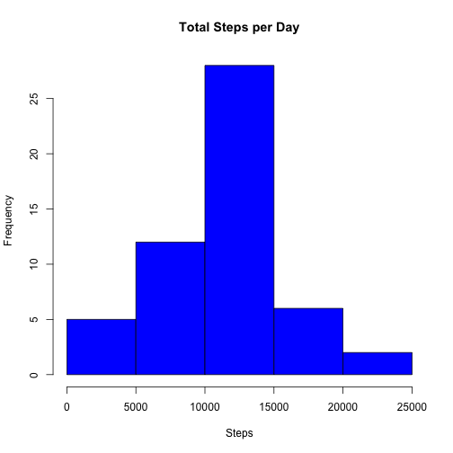
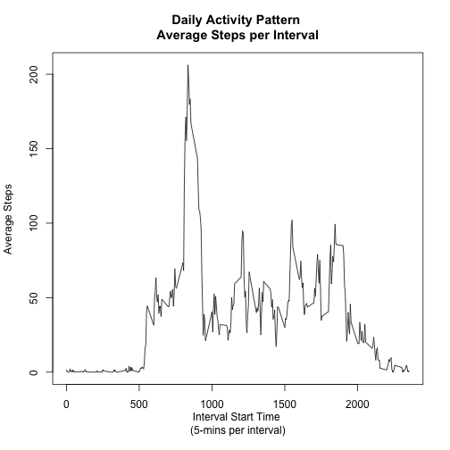
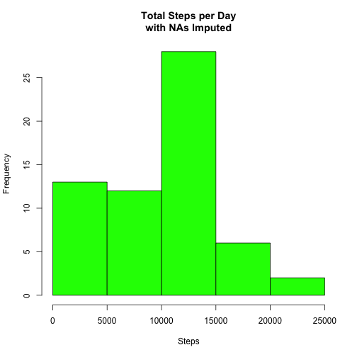
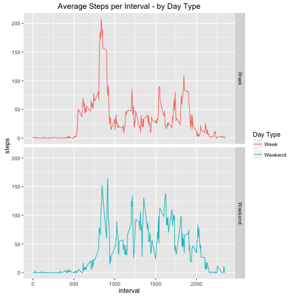

## Loading and preprocessing the data
Working directory is set to "RepData_PeerAssessment1"

#### Review Criteria #1 -- Code for reading in the dataset

```r
unzip("activity.zip")

## import raw data and save in separate dataframe to be maintained for reference
raw_d <- read.csv("activity.csv")

## create dataframe upon which to operate
df <- raw_d
```

Performing a little exploratory review of the data in order to understand what we have.

```r
summary(df)
```

```
##      steps                date          interval     
##  Min.   :  0.00   2012-10-01:  288   Min.   :   0.0  
##  1st Qu.:  0.00   2012-10-02:  288   1st Qu.: 588.8  
##  Median :  0.00   2012-10-03:  288   Median :1177.5  
##  Mean   : 37.38   2012-10-04:  288   Mean   :1177.5  
##  3rd Qu.: 12.00   2012-10-05:  288   3rd Qu.:1766.2  
##  Max.   :806.00   2012-10-06:  288   Max.   :2355.0  
##  NA's   :2304     (Other)   :15840
```

```r
str(df)
```

```
## 'data.frame':	17568 obs. of  3 variables:
##  $ steps   : int  NA NA NA NA NA NA NA NA NA NA ...
##  $ date    : Factor w/ 61 levels "2012-10-01","2012-10-02",..: 1 1 1 1 1 1 1 1 1 1 ...
##  $ interval: int  0 5 10 15 20 25 30 35 40 45 ...
```

```r
head(df, 15)
```

```
##    steps       date interval
## 1     NA 2012-10-01        0
## 2     NA 2012-10-01        5
## 3     NA 2012-10-01       10
## 4     NA 2012-10-01       15
## 5     NA 2012-10-01       20
## 6     NA 2012-10-01       25
## 7     NA 2012-10-01       30
## 8     NA 2012-10-01       35
## 9     NA 2012-10-01       40
## 10    NA 2012-10-01       45
## 11    NA 2012-10-01       50
## 12    NA 2012-10-01       55
## 13    NA 2012-10-01      100
## 14    NA 2012-10-01      105
## 15    NA 2012-10-01      110
```

```r
length(unique(df$date))
```

```
## [1] 61
```


```r
mean(is.na(df$steps))
```

```
## [1] 0.1311475
```

```r
range(df$interval)
```

```
## [1]    0 2355
```

My observations about the dataset:

- It looks like the interval column matches the time of day.
- There are 288 readings per day
- the data was collected on 61 different days in October and November, 2012
- the `steps` variable has 2,304 NA rows, which is about 13.1% of the observations
- `date` is a Factor and should be a Date object to make it easier to work with

#### Review Criteria #1 -- Code for  pre-processing the data

1. Converting `date` variable to a Date ojbect
1. Adding a `weekday` column
1. create a clean version of the dataset without NA values


```r
df$date <- as.Date(df$date)
df$weekday <- weekdays(df$date)

## `dfc` is a cleaned version (NA rows are removed)
dfc <- df[complete.cases(df), ]

## confirm there are no NAs remaining
any(is.na(dfc))
```

```
## [1] FALSE
```

## What is mean total number of steps taken per day?

```r
## aggregate the daily sums into a dataframe named 'daily_cleaned'
daily_cleaned <- aggregate(dfc$steps, by=list(dfc$date), FUN=sum)
names(daily_cleaned) <- c("Date", "Steps")
nrow(daily_cleaned)
```

```
## [1] 53
```

```r
summary(daily_cleaned)
```

```
##       Date                Steps      
##  Min.   :2012-10-02   Min.   :   41  
##  1st Qu.:2012-10-16   1st Qu.: 8841  
##  Median :2012-10-29   Median :10765  
##  Mean   :2012-10-30   Mean   :10766  
##  3rd Qu.:2012-11-16   3rd Qu.:13294  
##  Max.   :2012-11-29   Max.   :21194
```
Note: only 53 of the 61 days in the original data actually have step activity recorded.


```r
mean(daily_cleaned$Steps)
```

```
## [1] 10766.19
```

```r
median(daily_cleaned$Steps)
```

```
## [1] 10765
```

#### Review Criteria #2 -- Histogram of the total number of steps taken each day

```r
hist(daily_cleaned$Steps, xlab = "Steps", main = "Total Steps per Day", col="Blue")
```



#### Review Criteria #3 -- Mean and median number of steps taken each day
**Mean daily (cleaned) steps:     10,766.19**  
**Median daily (cleaned) steps:   10,765**


## What is the average daily activity pattern?

```r
## create an aggregate df of the average steps per interval
byInt_mn <- aggregate(steps ~ interval, dfc, mean)
## summary
summary(byInt_mn)
```

```
##     interval          steps        
##  Min.   :   0.0   Min.   :  0.000  
##  1st Qu.: 588.8   1st Qu.:  2.486  
##  Median :1177.5   Median : 34.113  
##  Mean   :1177.5   Mean   : 37.383  
##  3rd Qu.:1766.2   3rd Qu.: 52.835  
##  Max.   :2355.0   Max.   :206.170
```

#### Review Criteria #4 -- Time series plot of the average number of steps taken

```r
plot(byInt_mn, type="l", xlab = "Interval Start Time \n(5-mins per interval)", ylab = "Average Steps")
title(main = "Daily Activity Pattern \nAverage Steps per Interval")
```



From the summary of `byInt_mn` we see that the maximum value for `steps` is 206.170,
we can search for this row to find the 5 minute interval with the maximum average number of steps. 
The answer should correspond with the plot above, somewhere between 700 and 900.

#### Review Criteria #5 -- The 5-minute interval that, on average, contains the maximum number of steps

```r
steps_max <- max(byInt_mn$steps)
byInt_mn[byInt_mn$steps == steps_max, ]
```

```
##     interval    steps
## 104      835 206.1698
```

**The time interval starting at 8:35 am has the highest average number of steps**

## Imputing missing values
Going back to the original dataset, working with the `df` dataframe, which includes the NA values.  
I want to confirm that the `steps` variable is the only variable that includes NA values.

```r
unlist(lapply(df, function(x) any(is.na(x))))
```

```
##    steps     date interval  weekday 
##     TRUE    FALSE    FALSE    FALSE
```
CONFIRMED -- only the `steps` column has NAs.

```r
sum(is.na(df$steps))
```

```
## [1] 2304
```
**There are 2,304 rows with NA values in the `steps` column**

####Review Criteria #6 -- Code to describe and show a strategy for imputing missing data
Creating a daily summary dataframe `daily_all` which includes the NA values

```r
daily_all <- aggregate(df$steps, by=list(df$date), FUN=sum)
summary(daily_all)
```

```
##     Group.1                 x        
##  Min.   :2012-10-01   Min.   :   41  
##  1st Qu.:2012-10-16   1st Qu.: 8841  
##  Median :2012-10-31   Median :10765  
##  Mean   :2012-10-31   Mean   :10766  
##  3rd Qu.:2012-11-15   3rd Qu.:13294  
##  Max.   :2012-11-30   Max.   :21194  
##                       NA's   :8
```
From this summary we can see that 8 days don't have any recordings at all, so the daily sum is NA. 
For this reason, it won't make sense to use the daily average to fill in the NA values.

##### Strategy described
Instead, the strategy I will use is to fill in each NA `steps` value with the median value for the corresponding interval/day-of-the-week combination.
I will calculate the median value for that interval-weekday combo using the clean dataset `dfc` which had all NAs removed.

```r
byIntDay_md <- aggregate(steps ~ interval + weekday, dfc, median)
str(byIntDay_md)
```

```
## 'data.frame':	2016 obs. of  3 variables:
##  $ interval: int  0 5 10 15 20 25 30 35 40 45 ...
##  $ weekday : chr  "Friday" "Friday" "Friday" "Friday" ...
##  $ steps   : num  0 0 0 0 0 0 0 0 0 0 ...
```

##### The code for replacing the NA values

```r
## build a vector `nas` listing each index of df in which there is an NA value in the `steps` column
nas <- which(is.na(df$steps))

## cycle through `nas` getting each index of `df` with an NA value for `steps` 
## determine corresponding `interval` and `weekday`
## find the median `steps` for that interval-weekday from the `byIntDay_md` summary dataframe 
## and apply that value in place of the NA `df`
for(i in seq_along(nas)) {
    int <- df[nas[i], 3]
    day <- df[nas[i], 4]
    md_steps <- byIntDay_md[byIntDay_md$interval == int & byIntDay_md$weekday == day, 3]
    df$steps[nas[i]] <- md_steps
}
```

Create a new daily summary dataframe `daily_all_fixed` which includes the substituted median values in place of the NAs

```r
daily_all_fixed <- aggregate(df$steps, by=list(df$date), FUN=sum)
names(daily_all_fixed) <- c("Date", "Steps")

mean(daily_all_fixed$Steps)
```

```
## [1] 9705.238
```

```r
median(daily_all_fixed$Steps)
```

```
## [1] 10395
```

####Review Criteria #7 -- Histogram of the total number of steps taken each day after missing values are imputed

```r
hist(daily_all_fixed$Steps, xlab = "Steps", main = "Total Steps per Day\nwith NAs Imputed", col="green")
```


  
##### new updated averages (NA values replaced with weekday-interval medians)
**Mean daily steps:     9,705.24**  
**Median daily steps:   10,395**

##### Previously calculated averages (NA values removed)
**Mean daily steps:     10,766.19**   
**Median daily steps:   10,765**

##### Differences
**Mean difference: 10,766.19 - 9,705.24 = 1,060.95**  
**Median difference: 10,765 - 10,395 = 370**

## Are there differences in activity patterns between weekdays and weekends?


```r
library(ggplot2)

## separate weeks and weekends
df$cat <- ifelse(df$weekday %in% c("Monday", "Tuesday", "Wednesday", "Thursday", "Friday"), "Week", "Weekend")
df$cat <- as.factor(df$cat)
```

####Review Criteria #8 -- Panel plot comparing the average number of steps taken per 5-minute interval across weekdays and weekends

```r
## create an aggregate df of the average steps per interval per category
byIntCat_mn <- aggregate(steps ~ interval + cat, df, mean)
## summary
summary(byIntCat_mn)
```

```
##     interval           cat          steps        
##  Min.   :   0.0   Week   :288   Min.   :  0.000  
##  1st Qu.: 588.8   Weekend:288   1st Qu.:  1.617  
##  Median :1177.5                 Median : 23.686  
##  Mean   :1177.5                 Mean   : 35.433  
##  3rd Qu.:1766.2                 3rd Qu.: 56.655  
##  Max.   :2355.0                 Max.   :208.100
```

```r
## Panel plot with ggplot2
g <- ggplot(byIntCat_mn, aes(interval, steps, color = cat))
g + geom_line() + facet_grid(cat~.) + ggtitle("Average Steps per Interval - by Day Type") +
    labs(color = "Day Type")
```




